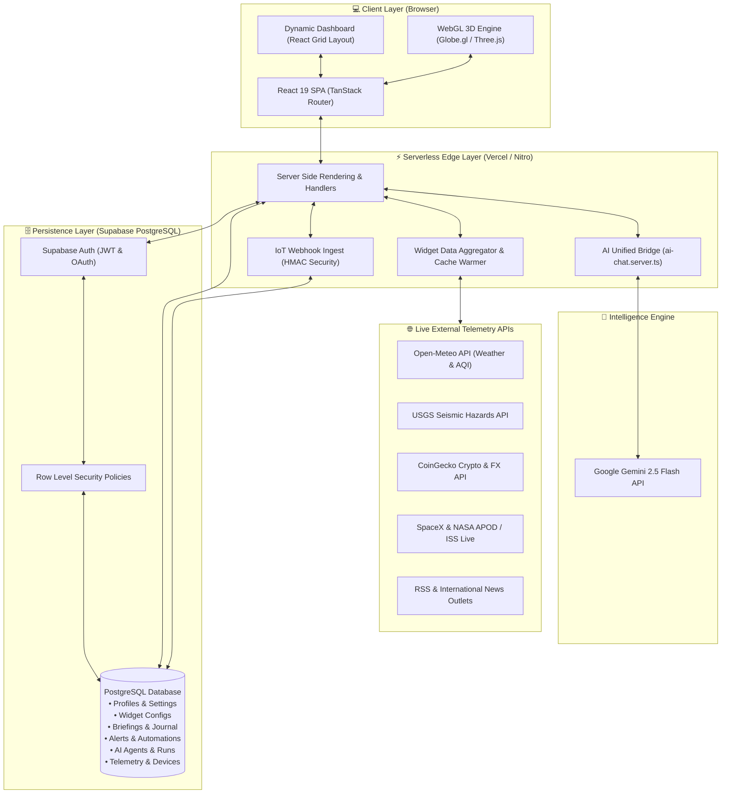

# OMNISPHERE 🌐 — Personal Global Awareness Command Center

<div align="center">


[](https://omni-globe-six.vercel.app)
[](LICENSE)

**One dashboard. The entire planet. Your voice in control.**

[Explore Live Demo](https://omni-globe-six.vercel.app) · [Report Bug](https://github.com/Tony1254-CS/omni-globe/issues) · [Request Feature](https://github.com/Tony1254-CS/omni-globe/issues)

</div>

---

## 🚀 Overview

**OMNISPHERE** is a next-generation real-time global awareness platform that consolidates planetary data into a unified, interactive mission control center. From local micro-climate metrics to global seismic events, cryptocurrency volatility, space operations, air quality indexes, and live international news — OMNISPHERE synthesizes raw telemetry into actionable intelligence using Google Gemini AI.

### Key Highlights
- 🛰️ **3D Interactive Digital Twin**: WebGL-powered 3D globe visualization rendering satellite tracking (ISS), seismic events, and active weather systems.
- 🤖 **Autonomous AI Executive Briefing (Pulse)**: Automated contextual summaries synthesized directly from your custom layout using **Google Gemini 2.5 Flash**.
- ⏳ **Time Machine Mode**: Temporal slider rewinding global satellite imagery, historical earthquakes, and headlines from **1975 to Present**.
- 🎯 **Foresight & Prediction Engine**: Probabilistic AI event forecaster with transparent Brier-score resolution tracking.
- 🔮 **Oracle Conversational Reasoning**: Threaded AI engine for real-time *what-if* world event scenario analysis.
- ⚡ **IoT Sensor Ingestion**: Secure HMAC-authenticated webhook gateway for personal hardware sensors (ESP32, Raspberry Pi, MQTT bridges).
- ⚙️ **Automations & Agents**: Event-driven rules engine and custom autonomous AI agents with dynamic tool execution.

---

## 🏛️ System Architecture

OMNISPHERE is architected as an edge-ready, serverless application utilizing **TanStack Start**, **Vite**, **Nitro**, **Supabase**, and **Google Gemini AI**.

<details>
<summary>🔍 <b>Click to expand System Architecture Diagram</b></summary>



</details>

---

## 🗄️ Database Entity-Relationship (ER) Diagram

The persistence layer is built on Supabase PostgreSQL with strict **Row Level Security (RLS)** ensuring isolated multi-tenant data privacy.

<details>
<summary>📐 <b>Click to expand Database ER Diagram</b></summary>

```mermaid
erDiagram
    users ||--o| profiles : "has profile"
    users ||--o{ user_roles : "assigned"
    users ||--o{ favourite_locations : "saves"
    users ||--o{ widget_configs : "customizes"
    users ||--o{ alerts : "configures"
    users ||--o{ briefings : "generates"
    users ||--o{ automations : "owns"
    users ||--o{ agents : "deploys"
    users ||--o{ devices : "registers"
    users ||--o{ shared_dashboards : "shares"
    users ||--o{ foresight_predictions : "tracks"
    users ||--o{ user_achievements : "earns"

    profiles {
        uuid id PK
        string display_name
        string avatar_url
        string timezone
        enum units
        double home_lat
        double home_lon
        string home_label
        timestamp created_at
    }

    user_roles {
        uuid id PK
        uuid user_id FK
        enum app_role role
    }

    favourite_locations {
        uuid id PK
        uuid user_id FK
        string label
        double lat
        double lon
        int sort_order
    }

    widget_configs {
        uuid id PK
        uuid user_id FK
        string widget_type
        int x
        int y
        int w
        int h
        jsonb settings
    }

    alerts {
        uuid id PK
        uuid user_id FK
        string label
        string kind
        string comparator
        double threshold
        jsonb params
        boolean enabled
        double last_value
        timestamp last_triggered_at
    }

    briefings {
        uuid id PK
        uuid user_id FK
        text content
        jsonb snapshot
        timestamp created_at
    }

    automations {
        uuid id PK
        uuid user_id FK
        string name
        string trigger_kind
        jsonb trigger_params
        string action_kind
        jsonb action_params
        boolean enabled
    }

    agents {
        uuid id PK
        uuid user_id FK
        string name
        string description
        text system_prompt
        text_array tools
        string model
    }

    devices {
        uuid id PK
        uuid user_id FK
        string name
        string device_key UK
        string hmac_secret
        string metric
        string unit
    }

    device_readings {
        bigint id PK
        uuid device_id FK
        uuid user_id FK
        double value
        timestamp recorded_at
    }

    shared_dashboards {
        uuid id PK
        uuid user_id FK
        string slug UK
        string title
        jsonb snapshot
    }

    foresight_predictions {
        uuid id PK
        uuid user_id FK
        string title
        text rationale
        double probability
        string status
        timestamp target_date
    }

    devices ||--o{ device_readings : "logs telemetry"
    automations ||--o{ automation_runs : "records history"
    agents ||--o{ agent_runs : "executes tasks"
```

</details>

---

## 📑 Feature Modules

| Module | Route | Key Capabilities |
|---|---|---|
| **Pulse** | `/pulse` | Cinematic morning AI briefing synthesized from your active telemetry & watched locations. |
| **Dashboard** | `/dashboard` | Fully customizable drag-and-drop grid supporting 15+ live telemetry widgets. |
| **Globe 3D** | `/globe` | WebGL earth view with ISS live vector tracking, seismic heatmaps, and temporal 1975 slider. |
| **Oracle** | `/oracle` | Interactive reasoning AI interface for real-time geopolitical & climate scenario analysis. |
| **Foresight** | `/foresight` | Probabilistic AI forecast tracker featuring transparent Brier score accuracy resolution. |
| **Briefings** | `/briefing` | In-depth executive world report builder with exported snapshot capabilities. |
| **Automations** | `/automations` | Event-driven automation workflows (*If AQI > 150 ➔ Send Alert & Log Journal*). |
| **Agents** | `/agents` | Custom AI agent sandbox equipped with web search and API execution tools. |
| **Devices** | `/devices` | Personal IoT device registry supporting HMAC-SHA256 authenticated HTTP ingestion. |
| **Time Machine** | `/globe?time` | Historical satellite imagery & news archives spanning 5 decades (1975 – Present). |

---

## 💻 Tech Stack

- **Frontend Core**: React 19, TypeScript, Vite 8, TanStack Start, TanStack Router, TanStack Query
- **3D & Graphics**: Globe.GL, Three.js, Lucide Icons, Recharts, Framer Motion
- **Styling**: Tailwind CSS v4, Radix UI Primitives, Sonner Toasts
- **Backend Runtime**: Nitro Serverless, Node.js
- **Database & Security**: Supabase PostgreSQL, Row Level Security (RLS), JWT Authentication
- **AI Engine**: Google Gemini 2.5 Flash (`generativelanguage.googleapis.com`)
- **Hosting & Infrastructure**: Vercel Edge Serverless Functions

---

## 🛠️ Quick Start (Local Setup)

### 1. Prerequisites
- Node.js `20.x` or higher
- npm or bun
- A free [Supabase](https://supabase.com) project
- A free [Google AI Studio](https://aistudio.google.com/apikey) API key

### 2. Clone & Install
```bash
git clone https://github.com/Tony1254-CS/omni-globe.git
cd omni-globe
npm install
```

### 3. Environment Configuration
Create a `.env` file in the root directory:
```env
DEPLOY_TARGET=vercel
VITE_SUPABASE_URL=https://<your-supabase-project>.supabase.co
VITE_SUPABASE_PUBLISHABLE_KEY=<your-supabase-anon-key>
SUPABASE_URL=https://<your-supabase-project>.supabase.co
SUPABASE_PUBLISHABLE_KEY=<your-supabase-anon-key>
SUPABASE_SERVICE_ROLE_KEY=<your-supabase-service-role-key>
GEMINI_API_KEY=<your-google-gemini-api-key>
```

### 4. Setup Database
Open your Supabase SQL Editor and execute the complete schema migration from [`supabase/all_migrations.sql`](file:///e:/antigravity/omni%20globe/supabase/all_migrations.sql).

### 5. Launch Development Server
```bash
npm run dev
```
Open [http://localhost:5173](http://localhost:5173) in your browser.

---

## 🚢 Deploying to Vercel

```bash
# 1. Build project using Nitro Vercel preset
$env:DEPLOY_TARGET="vercel"; npm run build

# 2. Deploy directly with Vercel CLI
npx vercel --prod
```

Set the following **Environment Variables** in Vercel Dashboard:
- `DEPLOY_TARGET`: `vercel`
- `VITE_SUPABASE_URL`: Your Supabase Project URL
- `VITE_SUPABASE_PUBLISHABLE_KEY`: Your Supabase publishable key
- `SUPABASE_URL`: Your Supabase Project URL
- `SUPABASE_PUBLISHABLE_KEY`: Your Supabase publishable key
- `SUPABASE_SERVICE_ROLE_KEY`: Your Supabase service role key
- `GEMINI_API_KEY`: Your Google Gemini API Key

---

## 📄 License

Distributed under the MIT License. See `LICENSE` for more information.

---

<div align="center">
Built with ❤️ for global awareness.
</div>
